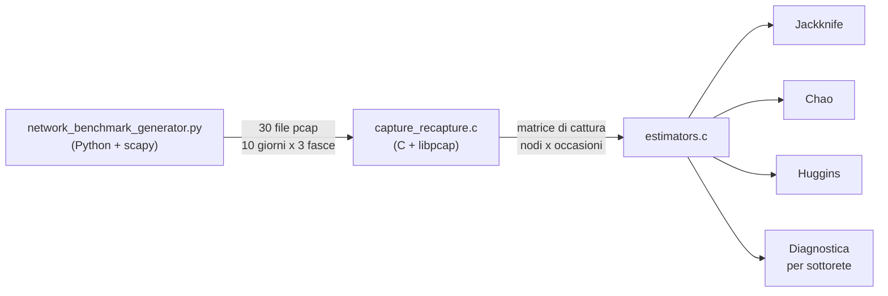

# tesi-laurea-victorino_informatica-triennale-unipi_2025-26

Repository contenente i codici, i dati e i grafici della tesi di laurea triennale in Informatica, Università di Pisa, a.a. 2025/26.

## Struttura della repository

```
├── network_benchmark_generator.py   generatore della rete simulata e del traffico (pcap)
├── capture_recapture.c              lettura dei pcap e matrice di cattura
├── estimators.c, estimators.h       stimatori Jackknife, Chao e Huggins
├── makefile                         compilazione e target dei 36 test
├── Benchmark_grafici.xlsx           risultati numerici di tutte le configurazioni
├── fig/                             grafici riassuntivi usati nella tesi
├── fig3d/                           spettri delle frequenze, un'immagine per popolazione
└── grafici3d_singoli/               spettri delle frequenze, un'immagine per configurazione
```

I file `pcap` non sono inclusi nella repository: si rigenerano in modo identico con il generatore e i semi indicati più avanti.

# Introduzione

Il progetto riguarda l’uso di tecniche di capture-recapture per stimare il numero di nodi non individuati durante una scansione passiva della rete. L’obiettivo è sfruttare osservazioni multiple e complementari per inferire la presenza di nodi nascosti, non direttamente visibili, e ottenere una stima più robusta della dimensione reale dell’infrastruttura. Questo approccio può essere utile in contesti in cui la visibilità della rete è parziale o incompleta, e in cui è necessario valutare con maggiore accuratezza la copertura delle attività di discovery.

# Piano di Lavoro

L’attività di ricerca si aprirà con una fase iniziale dedicata all’approfondimento teorico della piattaforma NotLine e allo studio dei modelli statistici di capture-recapture, con l’obiettivo di comprendere come adattare i classici algoritmi di stima della popolazione al contesto del monitoraggio di rete. Una volta consolidata la base teorica, il lavoro proseguirà con la progettazione di una strategia di acquisizione dati basata su osservazioni passive multiple, definendo i criteri temporali e spaziali necessari per ottenere campionamenti che siano tra loro complementari e statisticamente significativi.

Successivamente, il cuore del progetto si sposterà sullo sviluppo e sull’integrazione di un modulo software capace di elaborare i dati raccolti, applicando i modelli di inferenza per calcolare la probabilità di presenza di nodi nascosti all'interno dell’infrastruttura cyber-fisica. Questa fase richiederà un’attenzione particolare nella gestione dei falsi positivi e nella corretta categorizzazione delle identità rilevate per garantire la precisione delle stime.

La parte finale del percorso sarà dedicata alla validazione sperimentale del metodo attraverso il gemello digitale messo a disposizione da NotLine. In questo ambiente controllato, sarà possibile simulare diverse configurazioni di rete con un numero noto di nodi "invisibili" per misurare l’accuratezza dell’algoritmo e la sua capacità di risposta in scenari di visibilità degradata. Il lavoro si concluderà con la redazione della tesi, in cui verranno discussi i risultati ottenuti e valutato l'impatto di tale approccio sulla resilienza e sulla sicurezza complessiva del sistema monitorato.

# Architettura del sistema

Il sistema è composto da due parti indipendenti, che comunicano soltanto attraverso i file `pcap`.



| File | Ruolo |
|------|-------|
| `network_benchmark_generator.py` | Genera una rete simulata e il suo traffico sintetico. Conosce la numerosità reale N e le probabilità di presenza dei nodi, e produce un file `pcap` per ciascuna finestra di osservazione. |
| `capture_recapture.c` | Legge i file `pcap` nell'ordine dato, uno per occasione di cattura, e ricostruisce la storia di cattura di ogni nodo. Non riceve alcuna informazione sul generatore. |
| `estimators.c`, `estimators.h` | Calcolano e stampano gli stimatori a partire dalla matrice di cattura. |
| `makefile` | Compilazione e lancio dei 36 test. |

## Generatore di traffico

La popolazione è composta da un gruppo di server e da quattro classi di client (A, B, C e link-local), ripartiti per il 30% in ciascuna delle classi A, B e C e per il 10% nella classe link-local. A ogni nodo viene assegnata una sola volta una probabilità di presenza, estratta in modo uniforme da un intervallo che dipende dalla sua classe e dal profilo di traffico scelto (`molto_frequente`, `bilanciato`, `poco_frequente`). In ogni finestra la presenza di ciascun nodo è decisa da un'estrazione indipendente, e i pacchetti vengono composti fra i nodi presenti.

Ogni esecuzione produce trenta file, `giorno1_mattina.pcap` ... `giorno10_notte.pcap`. Il volume e la composizione dei protocolli variano per giorno e per fascia oraria.

La generazione è deterministica: con gli stessi semi `SEME_F` e `SEME_DATASET` i file prodotti sono identici byte per byte. Cambiando il solo `SEME_DATASET` si ottiene una replica indipendente della stessa popolazione.

## Programma di analisi

Ogni file `pcap` passato da riga di comando costituisce un'occasione di cattura, nell'ordine in cui compare. Per ogni pacchetto il programma registra separatamente mittente e destinatario: il MAC identifica il nodo, l'indirizzo IP decide se il nodo appartiene alla popolazione osservata. Sono ammessi solo indirizzi privati e link-local (IPv4) e link-local e unique-local (IPv6); un nodo viene contato al più una volta per occasione.

L'output contiene, nell'ordine:

1. la probabilità di cattura per sottorete (diagnostica descrittiva);
2. lo stimatore Jackknife, con tutti gli ordini fino al quinto, il test di selezione dell'ordine e lo stimatore interpolato;
3. lo stimatore di Chao, con i raffinamenti basati sui momenti e gli intervalli simmetrico e log-trasformato;
4. lo stimatore di Huggins, con i sette modelli candidati, la scelta per AIC, i test fra modelli annidati e il bootstrap condizionale.

# Installazione

Dipendenze (Debian/Ubuntu):

```bash
sudo apt install gcc make libpcap-dev libcap-dev python3 python3-pip
pip install scapy
```

Compilazione:

```bash
make            # produce capture_recapture.out
make clean      # rimuove oggetti ed eseguibile
```

Lo stimatore di Huggins ha alcuni parametri di compilazione, modificabili senza toccare il codice:

| Macro | Default | Significato |
|-------|---------|-------------|
| `HUG_USA_COVARIATE` | `1` | Usa la sottorete come covariata individuale (`0` la disattiva). |
| `HUG_MAX_CATEGORIE` | `12` | Numero massimo di categorie della covariata. |
| `HUG_MIN_NODI_CATEGORIA` | `2` | Nodi minimi perché una sottorete abbia una categoria propria. |
| `HUG_BOOT_REPLICHE` | `100` | Repliche del bootstrap condizionale. |

```bash
make clean && make CFLAGS="-Wall -O3 -pthread -DHUG_BOOT_REPLICHE=200"
```

# Esecuzione

## Generare un dataset

I parametri si impostano in testa a `network_benchmark_generator.py`:

| Parametro | Valori usati negli esperimenti |
|-----------|-------------------------------|
| `NUM_SERVER` | 3, 10, 15, 30 |
| `NODI_PER_CLASSE` | A, B, C = 300 e link-local = 100 (1000 host); 150/50 (500 host); 30/10 (100 host) |
| `PROFILO_SELEZIONATO` | `molto_frequente`, `bilanciato`, `poco_frequente` |
| `SEME_F`, `SEME_DATASET` | 1000, 0 |

Il generatore scrive i file nella directory corrente, che vanno poi spostati nella cartella del test corrispondente:

```bash
python3 network_benchmark_generator.py
mkdir -p bftest1 && mv giorno*_*.pcap bftest1/
```

## Lanciare un test

Il programma richiede i privilegi di root. Ogni target `bftestN` del makefile analizza i trenta file della cartella `bftestN/`, cioè l'intera rilevazione (t = 30):

```bash
make bftest1
```

I 36 test corrispondono alle configurazioni seguenti. In ogni terna l'ordine dei profili è `molto_frequente`, `bilanciato`, `poco_frequente`.

| Server | 1000 host | 500 host | 100 host |
|--------|-----------|----------|----------|
| 3      | 1, 2, 3   | 4, 5, 6  | 7, 8, 9  |
| 10     | 10, 11, 12 | 13, 14, 15 | 16, 17, 18 |
| 15     | 19, 20, 21 | 22, 23, 24 | 25, 26, 27 |
| 30     | 28, 29, 30 | 31, 32, 33 | 34, 35, 36 |

Per lanciarli tutti, salvando l'output di ciascuno:

```bash
make
mkdir -p risultati
for n in $(seq 1 36); do
    make -s bftest$n > risultati/bftest$n.txt
done
```

## Analisi cumulativa per giornata

Gli esperimenti della tesi seguono l'evoluzione delle stime nel tempo: per la giornata d si passano al programma i primi 3·d file. I file vanno elencati in ordine temporale esplicito, perché l'ordine alfabetico della shell metterebbe `giorno10` prima di `giorno2`:

```bash
TEST=bftest1
mkdir -p risultati/$TEST
for d in $(seq 1 10); do
    files=()
    for g in $(seq 1 $d); do
        for f in mattina pomeriggio notte; do
            files+=("$TEST/giorno${g}_${f}.pcap")
        done
    done
    sudo ./capture_recapture.out "${files[@]}" > risultati/$TEST/giorno$d.txt
done
```

## Uso su catture reali

Il programma accetta qualunque sequenza di file `pcap` con intestazione Ethernet, uno per occasione:

```bash
sudo ./capture_recapture.out cattura1.pcap cattura2.pcap cattura3.pcap ...
```

Jackknife e Chao sono studiati per almeno cinque occasioni: con meno file le stime vengono calcolate ma segnalate come indicative.

# Dati e grafici

## Benchmark_grafici.xlsx

Il file raccoglie l'output del programma di analisi per tutte le configurazioni, giornata per giornata (analisi cumulativa: la giornata d usa le prime 3·d occasioni).

**Fogli `Data Set 1` ... `Data Set 4`.** Ogni foglio corrisponde a un numero di server: 3, 10, 15 e 30. Contiene tre blocchi, uno per taglia della popolazione, nell'ordine 1000, 500 e 100 host. Ogni blocco ha trenta righe, cioè i tre profili di traffico per dieci giornate. Le colonne sono:

| Colonna | Contenuto |
|---------|-----------|
| `profilo_benchmark` | Profilo di traffico (`molto_frequente`, `bilanciato`, `poco_frequente`). |
| `giorno_cattura`, `t-esima cattura` | Giornata (1–10) e numero di occasioni corrispondenti (3–30). |
| `S_obs` | Nodi distinti osservati fino a quella giornata. |
| `f1` ... `f5`, `f_più_alte` | Nodi osservati esattamente 1–5 volte e più di 5 volte. |
| `stima_jackknife`, `stima_chao`, `stima_huggins` | Stime della numerosità dei tre stimatori; per Huggins è quella del modello con AIC minimo. |
| `conf_jackknife_lower/higher` | Intervallo di fiducia al 95% di Jackknife, troncato agli osservati. |
| `conf_chao_lower/upper` | Intervallo simmetrico di Chao, troncato agli osservati. |
| `conf_chao_log_lower/upper` | Intervallo log-trasformato di Chao. |
| `conf_huggins_lower/upper` | Intervallo normale asintotico di Huggins, troncato agli osservati. |
| `popolazione_reale` | Numerosità reale N della configurazione. |

Le celle delle stime sono colorate in base all'errore relativo rispetto a `popolazione_reale`, secondo la legenda in fondo a ciascun foglio: entro il 5%, fra il 5% e il 10%, fra il 10% e il 20%, oltre il 20%.

**Fogli con i grafici.** Ognuno contiene dodici grafici, uno per configurazione:

- `Curve di Accumulazione Catture`: crescita di `S_obs` nelle dieci giornate rispetto alla numerosità reale;
- `Traffico - Molto Frequente`, `Traffico - Bilanciato`, `Traffico - Poco Frequente`: traiettorie delle tre stime per il profilo indicato.

## fig/

Grafici riassuntivi sulle 36 configurazioni, riportati nei capitoli 4 e 5 della tesi.

| File | Contenuto |
|------|-----------|
| `fig1_errore_relativo.png` | Errore relativo medio dei tre stimatori per giornata, separato per profilo di traffico. Per Huggins sono escluse le stime superiori a 3N. |
| `fig2_errore_assoluto.png` | Errore relativo assoluto medio dei tre stimatori per giornata; mostra l'inversione fra Chao e Jackknife alla terza giornata. |
| `fig3_traiettorie_3srv.png` | Traiettorie delle stime nelle configurazioni con 3 server: righe per taglia, colonne per profilo, con N, gli osservati e le bande di confidenza. |
| `fig4_diagnostica.png` | Copertura campionaria (osservati su N) e rapporto fra nodi visti una e due volte, come mediana per profilo. |
| `fig5_intorno.png` | Intorno fra l'estremo inferiore log-trasformato di Chao e l'estremo superiore di Jackknife, per ogni configurazione a fine rilevazione, come scarto percentuale da N. |
| `fig6_accumulazione.png` | Curve di accumulazione degli osservati per tutte le configurazioni, con la numerosità reale come riferimento. |
| `fig7_traiettorie_<profilo>.png` | Traiettorie delle stime per tutte le configurazioni di un profilo, con le stesse convenzioni di `fig3`. |

## fig3d/ e grafici3d_singoli/

Spettri delle frequenze di cattura: superfici che mostrano, per ogni giornata, quanti nodi sono stati osservati esattamente k volte (k da 1 a 5, più la classe aggregata oltre 5).

- `fig3d/DataSet<n>_pop<N>_superficie.png`: un'immagine per popolazione, con i tre profili affiancati sulla stessa scala. `n` è il foglio di `Benchmark_grafici.xlsx` (numero di server) e `N` la numerosità reale.
- `grafici3d_singoli/DataSet<n>_<host>nodi-<server>server/`: le stesse superfici, un file per profilo, a risoluzione maggiore.

L'asse verticale è un numero di nodi, quindi le figure di taglie diverse vanno confrontate nella forma, non nell'altezza. La classe oltre 5 raccoglie venticinque classi e non è confrontabile con le singole, e la superficie interpola fra valori discreti.

# Materiale

Materiale su capture-recapture:

[Chao (1984)]: **Nonparametric estimation of the number of classes in a population.**
- Introduce l'estimatore alla base del calcolo dei nodi mancanti.

[Chao (1987)]: **Estimating the population size for capture-recapture data with unequal catchability.**
- Estende il modello ai casi in cui i soggetti (o i device) hanno probabilità diverse di essere catturati.

[Burnham & Overton (1979)]: **Robust estimation of population size when capture probabilities vary among animals.**
- Uno dei lavori fondamentali per la stima di popolazioni "chiuse" con eterogeneità.